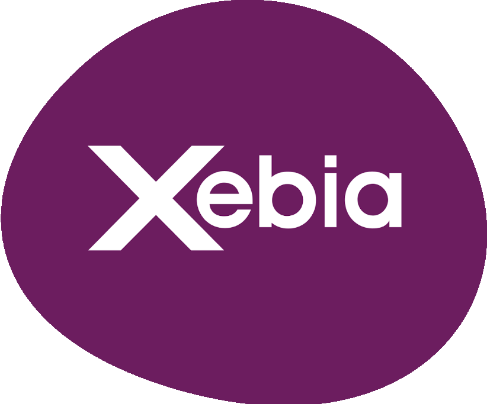
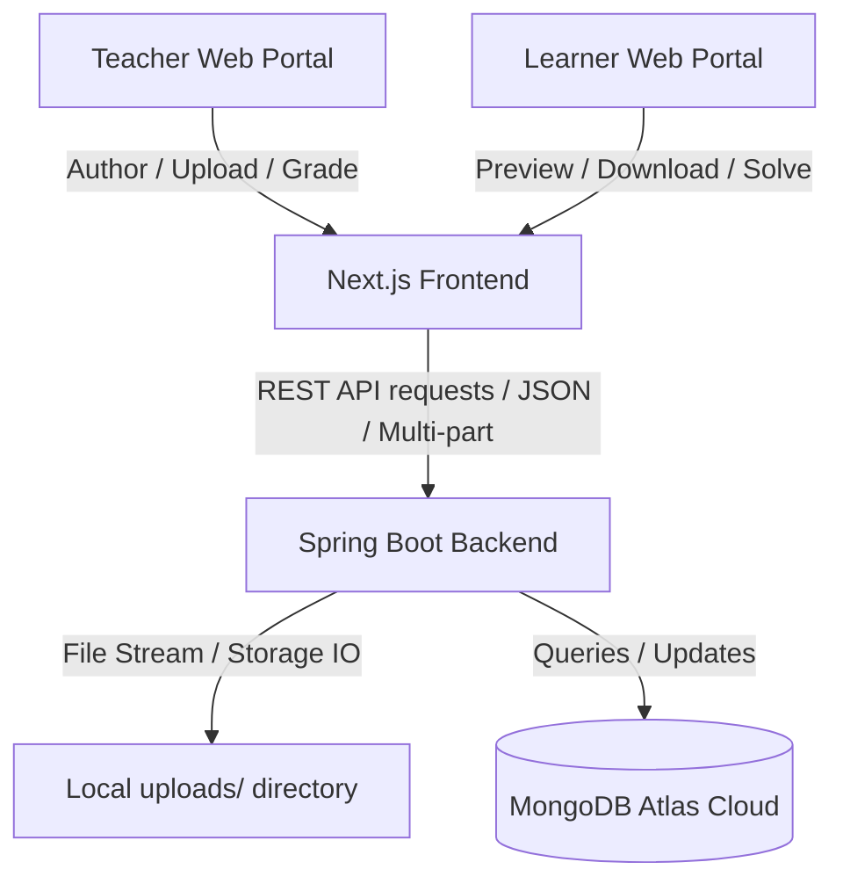

# Xebia LMS Assessment Portal

<p align="center">
  
</p>

<p align="center">
  A secure, modern, and high-performance enterprise assessment portal enabling teachers to author assessments, manage study materials, track submissions, and grade students, while providing learners a rich workspace with binary-safe document previews, downloads, and interactive assessment solving.
</p>

<p align="center">
  <!-- Badges -->
  
  
  
  
  
  
  
  
  
  
</p>

---

## 📖 Project Overview

The **Xebia LMS Assessment Portal** is a web-based learning management system module designed to streamline academic testing and grading workflows. 

### Why It Was Built
Traditional LMS platforms often treat assessment uploads as raw binary download links, forcing students to download documents locally, install external software (like MS Word or PDF readers), edit them, and re-upload. This project eliminates that friction by implementing **in-portal binary-safe rendering** for various document formats, keeping the learning and evaluation experience consolidated, secure, and fast.

### Business Purpose
* **Centralization**: All student submissions and teacher assessments reside securely in a remote MongoDB cloud instance.
* **Integrity**: Role-based access ensures learners can only view published materials and solve active assessments, preventing data leaks.
* **Analytics**: Real-time statistical dashboard elements give teachers visibility into average scores, pending submissions, and active courses.

---

## ✨ Features

### 👨‍🏫 Teacher Portal
* **Secure Auth & Toggle**: Fast role-based login to toggle between Teacher/Learner viewpoints.
* **Dashboard Analytics**: Visual counters detailing total students, assessments published, grading status, and submissions.
* **Author Assessments**: Interface to create assessments, input criteria, attach reference documents, and publish to specific student batches.
* **Binary File Uploads**: Upload references like PDF, DOCX, CSV, and TXT directly to local storage mapped to document database endpoints.
* **In-Portal Previews**: View inline documents instantly.
* **Submission Desk & Grading**: View list of student submissions, filter by grading status, download student solutions, grade their sheets, and leave feedback.
* **Material Uploads**: Publish extra course materials (cheatsheets, PDFs) to specific classes or batches.

### 🧑‍🎓 Learner Portal
* **Solve Assessments**: Interactive solves with real-time text input and multi-file submissions.
* **Inline Previews**: Preview uploaded DOCX, XLSX, PDF, TXT, CSV, and image files without leaving the portal.
* **Safe Binary Downloads**: Download exact duplicates of assessment files without zip corruption.
* **Grades & Feedback Viewer**: Instant access to test grades and instructor feedback upon completion of grading.
* **Global Filters**: Filter active assignments and class materials by time, batch, and subject.

---

## 🛠️ Tech Stack

| Layer | Technology | Details |
| :--- | :--- | :--- |
| **Frontend** | React, Next.js (App Router), TypeScript | Enterprise-quality client-side framework with Webpack optimization |
| **Styling** | Vanilla CSS, Tailwind CSS | Curated professional dark/light flat enterprise theme |
| **Backend** | Java, Spring Boot | REST APIs, custom controllers, and robust binary file streams |
| **Database** | MongoDB Atlas | Cloud-hosted document database for high availability and metadata storage |
| **Build Tools** | Maven, NPM | Package managers for clean compilation and dependency management |
| **Libraries** | Mammoth.js, SheetJS (XLSX) | Client-side converters for docx-to-html and xlsx-to-json-table rendering |

---

## 🏗️ Architecture



---

## 📂 Folder Structure

```
assessment-portal1/
├── .gitignore
├── README.md
└── assessment-portal/
    ├── app/                     # Next.js App Router (pages & navigation)
    │   ├── assessments/         # Solve, creation, and details views
    │   ├── dashboard/           # Core stats dashboards
    │   ├── materials/           # Shared student guides
    │   └── page.tsx             # Login interface & role selector
    ├── components/
    │   └── files/
    │       └── FilePreviewModal.tsx  # Document parser (Mammoth/SheetJS/Iframe)
    ├── backend/
    │   ├── pom.xml              # Maven dependencies
    │   ├── src/main/java/com/assessmentportal/
    │   │   ├── controller/      # API endpoints (Upload, Auth, Submissions)
    │   │   ├── model/           # MongoDB document entities
    │   │   ├── repository/      # MongoRepository interfaces
    │   │   └── seed/            # Seed data helper (DataSeeder.java)
    │   └── src/main/resources/
    │       └── application.properties  # Database connection properties
    ├── public/                  # Static assets & brand logos
    └── package.json             # Frontend script & packages
```

---

## 📷 Screenshots

### Login Page


### Teacher Dashboard


### Learner Dashboard


### In-Portal Document Preview


---

## ⚙️ Installation & Setup

### Prerequisites
* Java JDK 17+ Installed
* Node.js v18+ Installed
* MongoDB Atlas Cluster or Local MongoDB running

### 1. Clone the repository
```bash
git clone https://github.com/Pardhu643/Xebia-LMS-assessment-portal.git
cd Xebia-LMS-assessment-portal
```

### 2. Configure Environment Variables
Create a environment variable or a local config containing:
```bash
# Spring Boot Database connection
SPRING_DATA_MONGODB_URI="mongodb+srv://<username>:<password>@<cluster>.mongodb.net/employeeDB?retryWrites=true&w=majority"
```

### 3. Build & Run Backend
```bash
cd assessment-portal/backend
# On Windows PowerShell
$env:SPRING_DATA_MONGODB_URI="your_mongodb_atlas_uri"
.\mvnw.cmd spring-boot:run
```
The server starts on `http://localhost:8080`.

### 4. Build & Run Frontend
```bash
cd ../ # Move back to assessment-portal
npm install
npm run dev
```
Open **`http://localhost:3000`** in your browser.

---

## 🔑 Environment Variables Reference

| Variable Name | Description | Default Fallback |
| :--- | :--- | :--- |
| `SPRING_DATA_MONGODB_URI` | Cloud MongoDB Connection URI | `mongodb://localhost:27017/employeeDB` |
| `PORT` | Spring Boot web port | `8080` |

---

## 📡 API Overview

### Authentication
| Method | Endpoint | Description |
| :--- | :--- | :--- |
| `POST` | `/api/auth/login` | Login user, matches role, and authenticates |

### Assessments
| Method | Endpoint | Description |
| :--- | :--- | :--- |
| `GET` | `/api/assessments` | Fetch list of assessments |
| `POST` | `/api/assessments` | Create new assessment (Teacher) |

### File Manager
| Method | Endpoint | Description |
| :--- | :--- | :--- |
| `POST` | `/api/uploads` | Upload assessment/submission files |
| `GET` | `/api/files/preview/{filename}` | Serve raw binary file in-line (`inline`) |
| `GET` | `/api/files/download/{filename}` | Serve raw binary file for download (`attachment`) |

---

## 🔬 Core Functionalities & Validation

### 1. In-Portal Binary rendering
For each file type clicked in the previewer, `FilePreviewModal.tsx` parses the binary stream:
* **DOCX**: The file stream is retrieved as an `arrayBuffer`. We verify that the first two bytes match the official ZIP header `PK` (`0x50` and `0x4B`) to avoid unzipping text error payloads. It is then rendered using `mammoth.convertToHtml`.
* **XLSX**: Decoded into sheets using SheetJS and mapped directly into visual grid tables.
* **PDF**: Rendered inside a secure in-app `iframe`.

### 2. Role-Based Lifecycle
```
[Assessment Authored] ➔ [Attached Document Saved to uploads/] ➔ [Relative Preview Path Saved in MongoDB]
                                                                     │
[Learner Solves Assessment] ➔ [Uploads Answer Sheet] ➔ [Instructor Grades Solution & Leaves Feedback]
```

---

## 🚀 Future Enhancements
* **Redis Cache Layer**: Accelerate material fetch times using Redis.
* **Live Notifications**: Integrated WebSockets to alert students of new published tests.
* **Docker Containerization**: Containerize frontend and backend layers for scale.
* **CI/CD Pipeline**: Deploy directly to production via GitHub Actions.

---

## 🤝 Contributing
1. Fork the Project.
2. Create your Feature Branch (`git checkout -b feature/AmazingFeature`).
3. Commit your Changes (`git commit -m 'Add some AmazingFeature'`).
4. Push to the Branch (`git push origin feature/AmazingFeature`).
5. Open a Pull Request.

---

## 📄 License
This project is licensed under the MIT License - see the [LICENSE](LICENSE) file for details.

---

## 👤 Author
* **Pardhu Tirumalasetti** - *AI & Full Stack Developer*
* **GitHub**: [Pardhu643](https://github.com/Pardhu643)
* **LinkedIn**: [Pardhu Tirumalasetti](https://www.linkedin.com/in/pardhu-tirumalasetti-138379207/)
